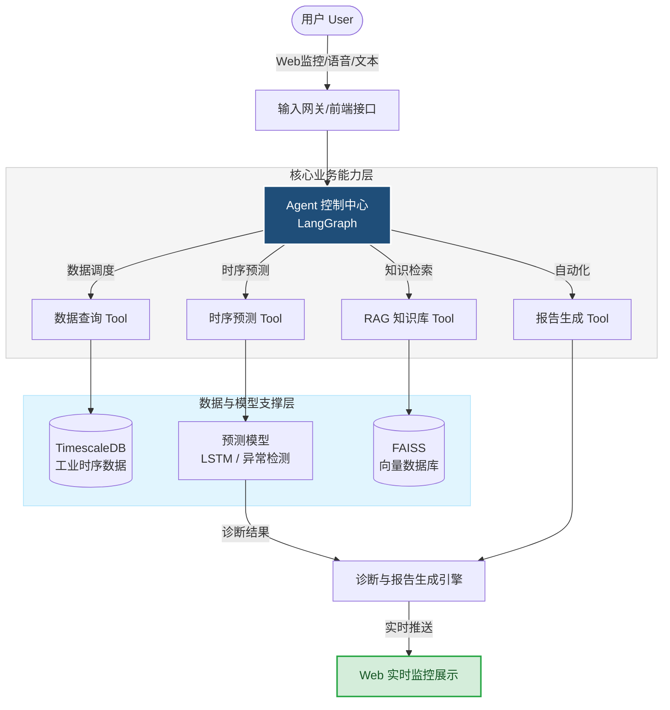
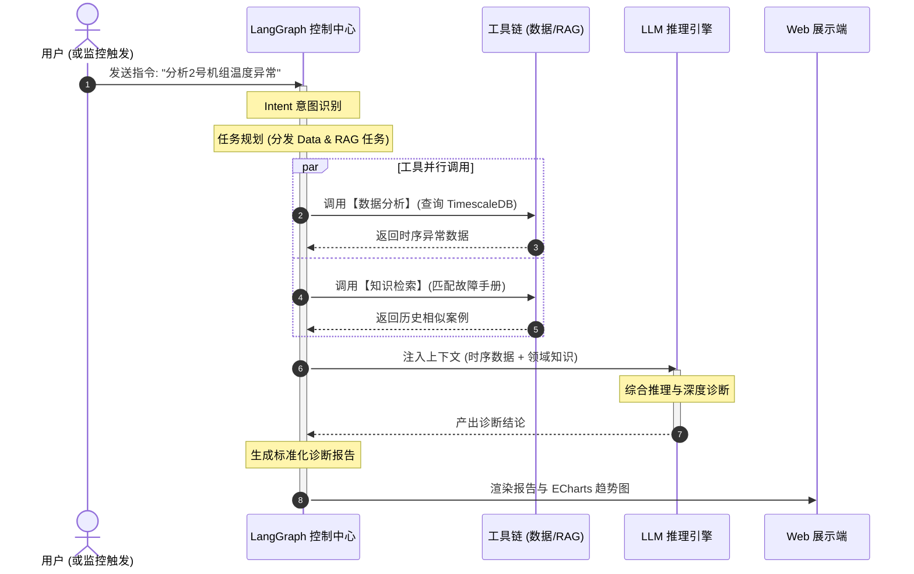

# Power-Agent
## 基于大语言模型Agent的电厂智能预警与故障诊断系统
>  这是一个面向工业电厂场景，融合LLM Agent、多源时序分析、RAG知识增强和自适应优化，实现设备异常监测、故障诊断与智能运维辅助的比赛项目。

## 项目背景

传统电厂运行监盘主要依赖人工经验：

- 设备参数数量巨大，人工难以及时发现异常趋势
- 预警响应滞后，对多类型预警的关联分析不足，难以提前预判风险;且缺少上下文关联，容易出现误报警
- 故障分析依赖专家经验，诊断效率低
- 监盘操作与问数历史缺乏联动追溯，难以实现全流程可追溯、可复盘

因此，本项目构建工业智能运维Agent，实现：

数据感知 → 异常发现 → 故障分析 → 决策建议 → 报告生成

的智能闭环。

## 核心亮点

### 1. 智能Agent任务调度

基于LangGraph构建工业诊断Agent：

用户输入自然语言：

> 分析2号机组过去24小时主蒸汽温度异常

Agent自动完成：

- 参数解析
- 数据查询
- 异常检测
- 故障知识检索
- 诊断报告生成

同步支持语音输入，快捷命令

### 2. 多策略异常检测

融合：

- 阈值异常
- 趋势变化异常
- 波动异常
- 预测残差异常

生成综合风险评分。

### 3. RAG故障知识增强

结合：

- 电厂运行规程
- 历史故障案例
- 设备说明文档

实现：

异常现象 → 相关案例 → 原因分析 → 处理建议

### 4. 人机协同监盘

提供Web监控平台：

- 实时监控
- 趋势分析
- 报警中心
- 故障诊断
- 自动报告

### 5.历史预警统计

  统计历史预警记录和数据，实现操作与问数历史联动追溯，全流程可追溯、可复盘
  
### 6.模型自适应优化

  支持基于不同工况（高负荷/低负荷）的模型切换与离线更新，
为后续在线自适应优化提供基础能力。

## 系统架构

## Agent Workflow

## 技术栈

|模块|技术|
|-|-|
|大语言模型|DeepSeek|
|Agent框架|LangGraph|
|后端|FastAPI|
|前端|Vue3 + ECharts|
|数据库|PostgreSQL + TimescaleDB|
|向量数据库|FAISS|
|时序模型|LSTM / Prophet|
|语音识别|Whisper/FunASR|
|部署|Docker|

## Demo展示

### 场景1：异常诊断

用户输入：

> 分析2号机组主蒸汽温度异常

系统输出：

设备:
2号机组

异常:
主蒸汽温度持续升高

风险:
0.87

可能原因:

1. 减温水流量不足
2. 调节阀异常

建议:

检查减温水系统。

## Project Structure

power-agent-system/

├── agent/
│   ├── LangGraph工作流
│   └── Tool调用

├── backend/
│   ├── API服务
│   └── 数据管理

├── algorithms/
│   ├── 异常检测
│   └── 时序预测

├── rag/
│   └── 故障知识库

├── frontend/
│   └── Web监盘

├── docs/
└── deployment/

## Requirements

Python >=3.10

Node >=18

PostgreSQL >=15

Docker >=24

> 后端：

cd backend
pip install -r requirements.txt
python main.py

> 前端：

cd frontend
npm install
npm run dev

##  Quick Start

### 1. 启动数据库

docker-compose up -d postgres

### 2. 初始化数据

python scripts/init_db.py

### 3. 启动后端

cd backend
python main.py

### 4. 启动前端

cd frontend
npm run dev

### 5. 访问

http://localhost:5173

## Demo Scenario

案例：

锅炉主蒸汽温度异常

流程:

1. Agent接收用户请求

2. 查询历史24小时数据

3. 检测异常趋势

4. 调用预测模型

5. RAG检索运行规程

6. 生成维修建议

结果：

提前30分钟发现风险

## Team

成员A:

- Agent开发
- 时序模型

成员B:

- 后端
- 数据库

成员C:

- 前端
- 系统部署

成员D:

- 测试
- 部分模块开发
- 比赛资料及ppt准备

## Future Work

- 接入真实DCS工业数据
- 引入多Agent协同诊断
- 支持更多设备类型
- 增加在线学习能力
- 部署边缘计算节点

