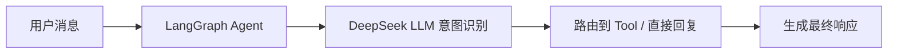

# A 成员 — Week 2 开发任务

## 上周回顾

| 任务 | 状态 | 说明 |
|------|------|------|
| P0-1 FastAPI 骨架 | ✅ 完成 | main.py / config / api / database / services 目录就绪，`/api/v1/health` 可用 |
| 接口规范定义 | ✅ 完成 | `agent/tools/base.py` 中 data_tool / alarm_tool / predict_tool / rag_tool 签名已锁定 |
| API 文档给 C | ✅ 完成 | `/api/v1/agent/chat` POST、`/api/v1/telemetry/live` GET 等 5 个端点已定义 |

## 本周目标

**实现 Agent 的"大脑"——LangGraph 工作流 + DeepSeek LLM 对接。**



---

## 任务 1：P0-2 — LangGraph Agent 状态与工作流

**截止**：Week 2 周三

### 要做什么

1. **定义 AgentState** (`agent/graph/state.py`)：
   - 字段：`messages`、`intent`、`params`、`tool_calls`、`final_response`
   - 使用 LangGraph `TypedDict` 或 `BaseModel`

2. **构建工作流** (`agent/graph/workflow.py`)：
   - 节点：`intent_router` → `tool_executor` → `response_generator`
   - 条件边：根据 intent 路由到不同 tool 节点或直接回复
   - Tool 节点初期用 mock 返回值（B 和 D 的 tool 函数到位后再切换）

3. **Tool 注册中心** (`agent/tools/__init__.py`)：
   - 统一注册 B 和 D 提供的 tool 函数
   - 定义 tool 调用接口适配层

### 产出文件

```
agent/
├── graph/
│   ├── state.py         ← AgentState 定义
│   └── workflow.py      ← LangGraph StateGraph 构建 + 主循环
├── tools/
│   ├── __init__.py      ← Tool 注册中心
│   ├── base.py          ← ✅ 已完成（接口规范）
│   ├── data_tool.py     ← 对接 B（本周先 mock）
│   ├── alarm_tool.py    ← 对接 B（本周先 mock）
│   ├── rag_tool.py      ← 对接 D（本周先 mock）
│   └── report_tool.py   ← 报告生成（本周先 mock）
```

### 验收标准

```python
from agent.graph.workflow import create_agent

agent = create_agent()

# 测试 1：诊断类意图
result = agent.invoke({"messages": ["分析2号机组温度异常"]})
assert result["intent"] is not None
assert "anomaly" in result["intent"].lower() or "diagnosis" in result["intent"].lower()

# 测试 2：闲聊类意图
result = agent.invoke({"messages": ["你好，你是谁"]})
assert result["final_response"] is not None
```

---

## 任务 2：P0-3 — DeepSeek LLM 对接 + 意图识别

**截止**：Week 2 周五

### 要做什么

1. **System Prompt 设计** (`agent/prompts/system_prompt.py`)：
   - 角色定位：电力运维 AI 助手
   - 列出可用 Tool 及其描述
   - 参数抽取模板（从自然语言中提取 device_id / parameter / time_range）

2. **意图分类 + 参数抽取**：
   - 5 类意图：`data_query` | `anomaly_detection` | `prediction` | `diagnosis` | `chat`
   - Few-shot 示例 (`agent/prompts/intent_examples.py`)

3. **LLM 调用封装**：
   - 使用 `langchain-openai` 兼容方式调用 DeepSeek API
   - 处理 API 异常（超时、限流、key 错误）

### 预期输出

输入 `"分析2号机组过去24小时主蒸汽温度异常"` → LLM 返回：

```json
{
  "intent": "anomaly_detection",
  "params": {
    "device_id": "generator_002",
    "parameter": "steam_temp",
    "time_range_hours": 24
  }
}
```

### 验收标准

- 10 条测试指令中至少 8 条意图识别正确，参数抽取完整
- 测试用例由 D 本周同步提供（`tests/agent/intent_test_cases.json`）
- DeepSeek API 调用延迟 < 5 秒（正常网络）

---

## 任务 3：与 B、D 确认 Tool 对接进度

**截止**：Week 2 周五

| 对接人 | 确认事项 | 当前状态 |
|--------|---------|---------|
| B | `data_tool()` / `alarm_tool()` 函数签名已锁定，本周 B 开始实现 | 签名已定，实现中 |
| B | 模拟数据生成进度（至少 3 设备 × 7 天数据） | B 本周 P0-2 |
| D | `rag_tool()` 函数签名已锁定，D 本周开始知识文档 + FAISS | 签名已定，实现中 |
| D | 意图识别测试用例 10 条 | D 本周提供 |

---

## 本周沟通要点

- **周三前**：完成 P0-2 workflow，确保 Agent 图可运行（tool 节点用 mock）
- **周三**：与 B 同步 data_tool mock 返回值格式，确认一致
- **周五前**：完成 P0-3 DeepSeek 对接，与 D 提供的测试用例联动验证
- **周五**：将本周成果提交 PR（分支 `feature/agent-core`）
